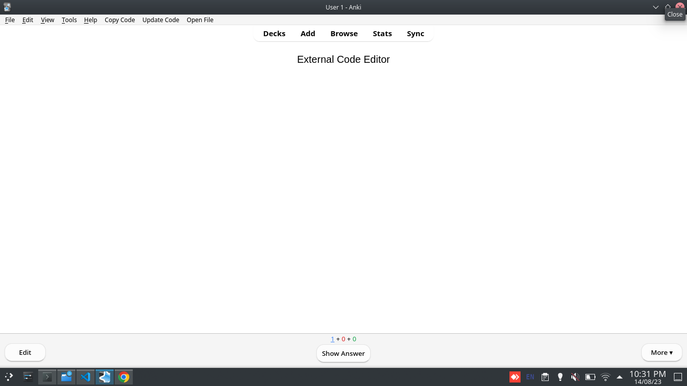

# Copy, Edit & Run Notetype Code in Review from External Ediotr
===============================================================

** This is an addon for [Anki version 2.1](https://apps.ankiweb.net/). It provides Code editing and updating in review from external editor. Copy code from review to a html file, edit html file and run code in review just like a browser. Updates notetype code directly in review state. It might be useful when developing an add-on or creating complex card templates.**

### Requirements
* Supports Anki >= v2.1.20

### Usage
* Adds an item <b>Copy Code</b> & <b>Update Code</b> to the menubar in Review State.
* Copy Code (Ctrl+C), creates a html file with profile name in collection.media and copy code of current notetype to html file. 
* Edit html file in collection.media using any external editor(VSCode).
* Update Code (Ctrl+S), updates code from html file to notetype in review and reloads the current card.
* Use addon [AnkiWebView Inspector](https://ankiweb.net/shared/info/31746032) to inspect code for any errors and issues.

### Screenshots

To download and install the addon [visit here](https://ankiweb.net/shared/info/1732661953).

Works with Anki >= v2.1.20

------

## Author

**Venkata Ramana P**

+ [https://itsmepvr.github.io](https://itsmepvr.github.io)
+ [https://github.com/itsmepvr](https://github.com/itsmepvr)
+ [https://linkedin.com/in/itsmepvr](https://linkedin.com/in/itsmepvr)

------

## Copyright and license

Copyright 2019 Itsmepvr under [The MIT License (MIT)](LICENSE).
